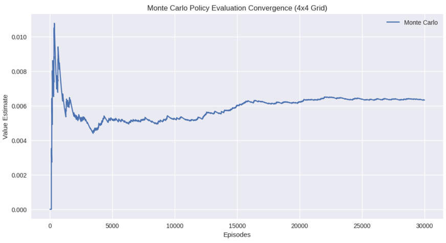
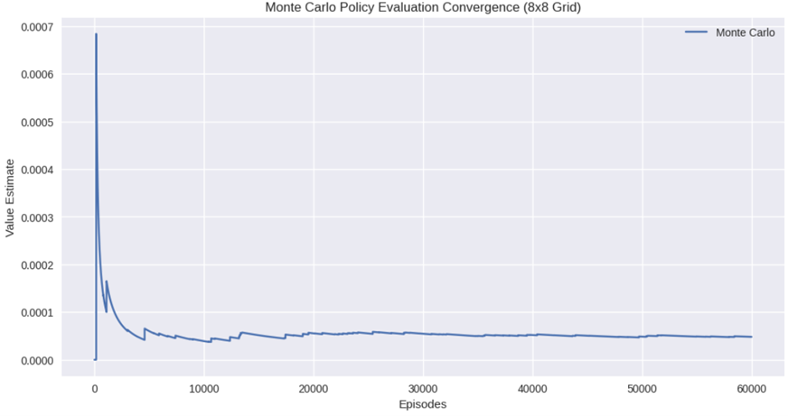
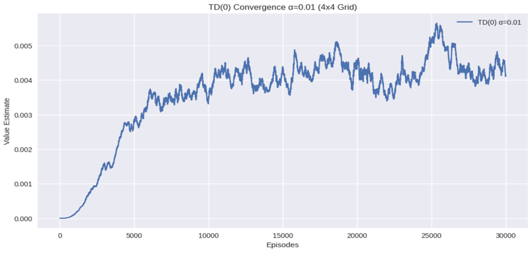
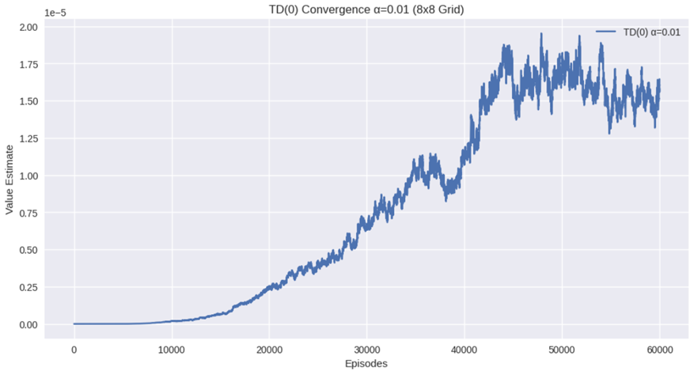
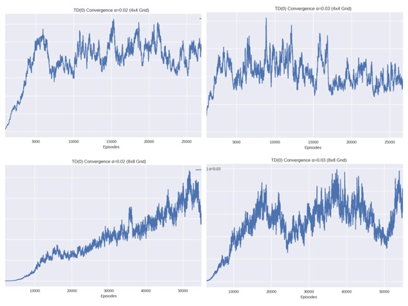
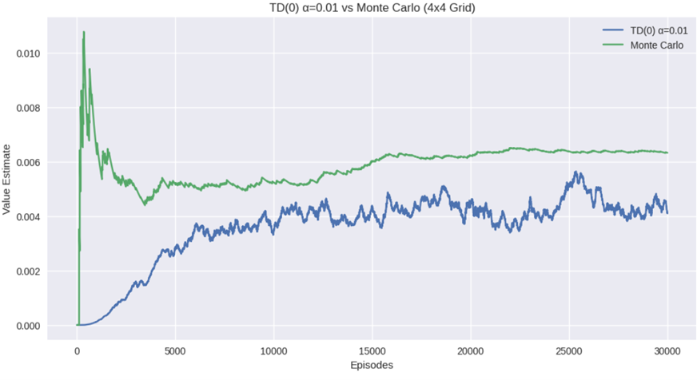
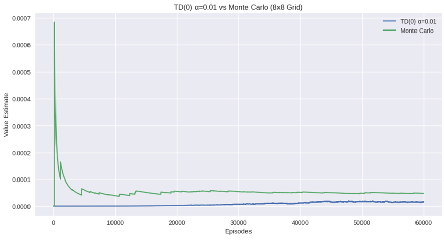
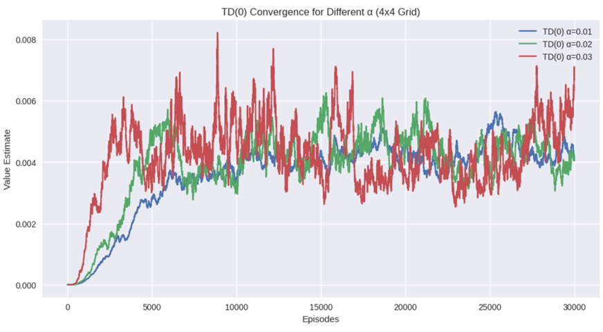
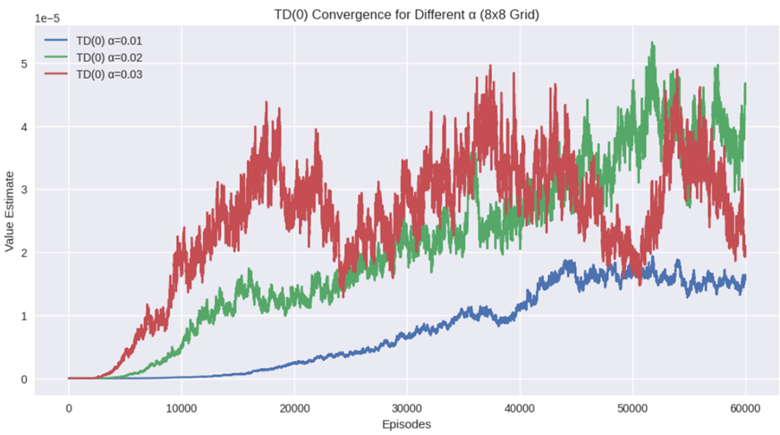
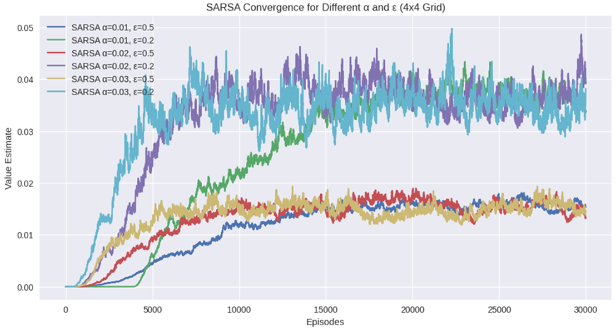

# Convergence Speed of Monte Carlo VS TD

According to theory, Monte Carlo method often requires more episodes than TD method to achieve a stable convergence. From the implementation Monte Carlo updates value estimates at the end of each episode, so we need a return from a complete episode. This requires more episodes to reach stable estimates. On the other hand TD updates estimates at each step within an episode, this incremental learning and continuously estimating values during each episode enables TD to lean often from fewer steps.

## Monte Carlo(MC) Initial High Variance

MC updates once per episode so it has initial high variance and can take longer to average out to stable value. I other words we can also say that MC needs more episodes than TD to reduce the variance. TD uses bootstrapping by updating based on current estimates rather than waiting for the whole return, lack of bootstrapping typically require MC to observe the environment over many episodes to reach the same level of accuracy as TD.

---

There are two separate analyses just to experiment how crucial hyperparameter tuning play in Reinforcement Learning.

## Analysis1:
1) We will analyse Monte Carlo and TD(0) using the parameters specified in the Action selection is Random in the first case instead of Epsilon Greedy  
2) For Analysis1, hyperparameter ‘alpha’ is analysed to identify the optimum learning rate.

## Analysis2:
1) This time learning rate is implemented with Epsilon Greedy Action Selection and analyse the result.  
2) Analysis 1 is based on total randomness; this time we are considering Epsilon Greedy to balance greediness and randomness.

---

| S.No | Environment Setup               | Parameters                                                |
|-----:|:--------------------------------|:-----------------------------------------------------------|
|    1 | Algorithms Implemented          | 1) Monte Carlo   2) TD(0)                             |
|    2 | Grid Size                       | 1) 4X4   2) 8X8                                       |
|    3 | Slippery                        | True                                                      |
|    4 | Discount Factor                 | 0.9                                                       |
|    5 | Epsilon                         | 1) 0.5   2) 0.2                                       |
|    5 | Learning Rate (only applicable to TD) | 1) 0.01   2) 0.02   3) 0.03                           |

**Table 1**

---

## Monte Carlo Policy Evaluation Convergence

### Observation(4x4)

The MC was implemented with discount factor as 0.9, it showed an initial rapid change in the value of the initial state V(0), and it’s followed by stabilization. It has a larger initial value because the estimates are updated only at the end of each episode. As we increase the number of episodes the estimate will converge to a true value.

### Observation(8x8)

As the grid size increased to 8X8 we can observe a greater initial spike and gradually it get very close to the true value. Because of the increased state space we can see delay in stabilization.

### Convergence

Convergence is observed later in 8X8 when compared with 4X4, possibly because of the increased state space. Clearly MC’s estimate a more stable in the long run, it takes more episodes to reach the convergence when compared with General TD with optimal learning rate because of the high initial variance and the ‘slippery’ environment.

---

## TD Convergence (α = 0.01)

### Observation(4x4)

This is the lowest value of alpha implemented here for the frozen lake with slipping, the plot shows a stable increase in value estimate, this lower alpha is minimizing the oscillation.

### Observation(8x8)

Similar to 4X4 grid, 8X8 shows a stable convergence at a lower learning rate making it suitable for the larger slippery grid.

### Convergence Rate Observed

It aligns with our expectation as smaller learning rate (α = 0.01) will lead to slower update in the value estimate. The rate of convergence is significantly slower in 8X8 when compared with 4X4 because of the increased state space and in turn requires more episodes to process.

---

## TD Convergence 4X4 and 8X8 (α > 0.01)

### Observation(4X4) and (8X8)

For both grid sizes we can see that higher learning rates such as 0.02, 0.03 we observe a faster update in the value estimate for each step but it results in plots that are unclear because of the oscillations in the value estimate. This suggests that these values of alpha may be too high to reach convergence. Even though we reach close to the true value its hard because the values wont settle and continue to fluctuate.

---

## Comparison between TD(0) (learning rate(best α = 0.01) and Monte Carlo

### Observation(4x4)

Monte Carlo reaches close to the stable value very quickly, while TD(0) continue to increase, because of the average over complete episodes MC appears to converge closer to the true value faster.

### Observation(8x8)

Monte Carlo in 8x8 grid converges more slowly and takes significantly more episodes to stabilize compared to TD(0) with learning rate as 0.01. Hyperparameters like alpha have significant effect on TD which make it very sensitive.

### Convergence Speed

In 4x4 when we are considering learning rate as 0.01, which is less so Monte Carlo method demonstrates quicker convergence particularly when TD(0) is using a small learning rate. When we consider 8x8 grid, TD(0) reaches reasonable estimate along with Monte Carlo. However Monte Carlo’s stability remains its key strength.

---

## Combined TD(0) and Monte Carlo Convergence

### Observation

With this plot we can analyse the trade-offs of choosing a higher alpha, we can either go for learning rate as low as 0.01 for better stability or Monte Carlo method which demonstrates quicker convergence particularly when TD(0) is using a small learning rate.

We can conclude that in this environment 4X4 and 8x8 Monte Carlo has more stable convergence, TD(0) on the other hand is more sensitive to learning rate. With lower learning rate we get stability in estimated values but slower convergence but with higher leaning rate faster convergence with instability.

---

## TD Convergence for different α-alpha

(The plots in this subsection may look disturbing, but in order to obtain meaningful insight comparing different TD with varying alpha this subsection is implemented)

### Observation(4x4)

The TD(0) methods convergence varies significantly depending on the learning rate α-alpha. From the implementation smaller value of alpha (example α = 0.01) is observed to produce smoother convergence but it is at a slower rate.

### Observation(8X8)

Similarly, Here the convergence relies heavily on the learning rate as well, smaller alpha provide slower but more stable convergence than larger alpha.

### Stability

In both 4X4 and 8X8, with a higher α-alpha, we observe that the value estimator is unstable and oscillate heavily (example α = 0.1) , clearly this higher alpha is not stable to update the value estimates. A lower α-alpha (example α = 0.01) on the other hand reduces the oscillation or fluctuation but a lower alpha will converge more slowly, we may have increase the number of episodes.

---

## Analysis Summary Table

| Metrics Compared                 | 4X4 Grid                                    | 8X8 Grid                                     |
|:--------------------------------|:--------------------------------------------|:---------------------------------------------|
| Monte Carlo Convergence Speed   | Observed Faster Stabilization   (~ 20,000 episodes)        | Observed Slower Stabilization   (~ 40,000 episodes)   |
| TD(0) Convergence Speed         | Quicker (~ 10000 episodes for learning rate = 0.01)            | Slower (~ 30000 episodes for learning rate = 0.01)         |
| Learning rate Sensitivity       | Higher learning rate caused moderate oscillation               | Higher learning rate caused severe oscillation             |
| Stability                       | Stable at learning rate = 0.01                                  | Stable at learning rate = 0.01, but slower than 4X4         |
| Episodes for Convergence        | Fewer due to a smaller state space                              | More due to larger state space                              |

---

# Analysis 2

In order to incorporate Epsilon Greedy with learning Rate we are using SARSA(On-Policy TD learning)

### Observation

### Learning Rate Sensitivity

Similar to Analysis 1, even with Epsilon Greedy action selection we observe relatively similar results, with increase in learning rate we can see a increase in the instability. On the other hand smaller learning rate leads to Smoother convergence.

### Convergence

If we notice the plot carefully, we can observe that the three colour in the lower(red,blue,brown) all of these have a Epsilon of 0.5. The colours converging together at the top have a Epsilon of 0.2. Its clear that irrespective of the learning rate the value of epsilon played a crucial role in the convergence

**Higher (Epsilon = 0.5):**  
Encourages exploration and is crucial early stages or in high-variance environments like the slippery Frozen Lake. We can observe a slower initial convergence due to frequent random action, this is the reason why the three colours in the lower(red, blue, brown) form like that.

**Lower (Epsilon = 0.2):**  
Faster initial convergence due to the more exploration of the current best policy.

---

_Thank you for reading!_
